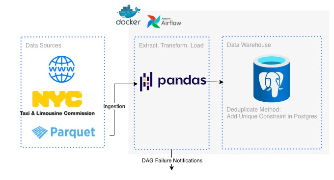

Certainly\! Here is the README translated into English, using the title **`nyc-tlc-etl-airflow-pandas-postgres`**.

-----

## 🚕 nyc-tlc-etl-airflow-pandas-postgres

A robust Data Engineering pipeline designed to perform the **Extract, Transform, Load (ETL)** process on **NYC Taxi & Limousine Commission (TLC)** data into a structured data warehouse using **Docker**, **Apache Airflow**, and **PostgreSQL**.

### 🌟 Project Overview

This project implements a complete ETL pipeline that ingests public data from the NYC TLC and loads it into a PostgreSQL data warehouse. The core focus is on efficient orchestration, reliable data transformation using Pandas, and ensuring data integrity through a strong deduplication method in the target database.



### 🎯 Key Technologies Used

| Technology | Role in the Pipeline |
| :--- | :--- |
| **Docker** | Provides a consistent and isolated environment for all services. |
| **Apache Airflow** | Orchestrates and schedules the entire ETL workflow (DAGs). |
| **Pandas** | Performs all transformation and data cleaning operations within the Transform phase. |
| **PostgreSQL** | Serves as the final Data Warehouse for storing the processed data. |
| **Parquet** | One of the efficient data sources, utilizing columnar file format for I/O efficiency. |

### 🏗️ Pipeline Architecture

The data flow is divided into three main stages, all orchestrated by Apache Airflow:

1.  **Data Sources:**

      * **Web/WWW:** Raw data retrieval from online TLC sources (e.g., historical data via HTTP).
      * **NYC Taxi & Limousine Commission:** The primary dataset focus of the project.
      * **Parquet:** Ingesting data from existing Parquet files for efficient processing.

2.  **Extract, Transform, Load (ETL):**

      * **Ingestion:** Data is pulled from the sources.
      * **Pandas:** Data passes through a series of transformation, cleaning, and standardization steps using the Pandas library.
      * **Load:** The transformed data is loaded into the Data Warehouse.

3.  **Data Warehouse (PostgreSQL):**

      * Data is stored within the PostgreSQL database schema.
      * **Deduplication Method:** Data integrity is guaranteed by adding a **`Unique Constraint`** on key columns in PostgreSQL, which automatically prevents duplicate data from being inserted.

### ⚙️ Setup and Installation

#### Prerequisites

  * Docker and Docker Compose.

#### Running the Project

1.  **Clone the Repository:**

    ```bash
    git clone https://github.com/ramadiansyah/nyc-tlc-etl-airflow-pandas-postgres.git
    cd nyc-tlc-etl-airflow-pandas-postgres
    ```

2.  **Start the Services:**
    Use Docker Compose to launch the Airflow services and the Postgres database.

    ```bash
    docker-compose up -d
    ```

3.  **Access Airflow:**

      * Wait a few moments for all Airflow services to initialize.
      * Access the Airflow UI at `http://localhost:8080` (or your configured port).

4.  **Run the DAG:**
    Find and activate the main DAG (e.g., `nyc_tlc_etl_dag`) in the Airflow UI to start the pipeline.

### 🚨 DAG Failure Notifications

Airflow is configured to send **DAG Failure Notifications** immediately upon any workflow failure. This mechanism ensures that the data engineering team can detect and resolve pipeline issues proactively.

### 🛡️ Data Deduplication Strategy

To ensure the highest data quality, the project implements a direct deduplication strategy at the database layer:

> **Deduplicate Method: Add Unique Constraint in Postgres**

A `UNIQUE` constraint is applied to the columns that uniquely identify a row (e.g., trip ID, pickup timestamp). This forces PostgreSQL to reject any attempted duplicate insertions, keeping the Data Warehouse clean and reliable.

